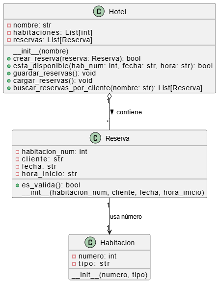

# 🏨 Hotel Python – Sistema de reservas por consola

Pequeña aplicación CLI en Python que gestiona reservas de cinco habitaciones mediante un archivo JSON local.  
Permite:

- **Crear reservas** por fecha, habitación y franja horaria
- **Consultar reservas** filtrando por nombre de cliente
- **Persistir datos** automáticamente en `reservas.json`
- Validar que el horario introducido esté dentro de las franjas definidas  
  (`mañana`, `tarde`, `noche`)

---

## Introducción
El presente proyecto describe el desarrollo de una actividad práctica enfocada en el trabajo colaborativo y la aplicación de principios fundamentales de la Programación Orientada a Objetos (POO). La consigna consistió en formar equipos de tres integrantes con el objetivo de diseñar e implementar una aplicación básica para la gestión de reservas en un hotel.

El propósito principal de la actividad fue fomentar la organización, la distribución eficiente de tareas según las habilidades de los integrantes, y la colaboración efectiva para lograr un producto funcional en un entorno simulado de desarrollo ágil. Durante la ejecución del trabajo, se utilizaron herramientas de control de versiones como GitHub o GitLab, permitiendo así una experiencia más cercana al entorno profesional de trabajo en equipo en proyectos de software.

Este REDME detalla las decisiones tomadas en la fase de planificación, el diseño e implementación de las clases requeridas (Hotel, Habitación y Reserva), así como la validación del correcto funcionamiento de funcionalidades clave como la creación de reservas y la consulta de disponibilidad.

## Objetivos
### Objetivo General
Desarrollar una aplicación básica de gestión de reservas en un hotel, aplicando principios fundamentales de la Programación Orientada a Objetos (POO) en un entorno de trabajo colaborativo.

### Objetivos Específicos
- Fomentar el trabajo en equipo mediante la asignación de roles y responsabilidades según las habilidades de cada integrante.
- Planificar y distribuir eficientemente las tareas necesarias para cumplir con los requerimientos de la aplicación en el tiempo establecido.
- Diseñar e implementar las clases principales del sistema (Hotel, Habitación y Reserva) utilizando buenas prácticas de POO.
- Utilizar herramientas de control de versiones como GitHub o GitLab para facilitar la colaboración, la integración del código y el seguimiento del trabajo en equipo.

## Identificación del Problema
En el contexto actual de la industria hotelera, la gestión eficiente de reservas es fundamental para garantizar una buena experiencia del cliente y una correcta administración interna. Muchos sistemas manuales o mal estructurados pueden generar errores como reservas duplicadas, falta de disponibilidad no reportada o dificultades para visualizar el estado de ocupación del hotel.

---

## 📁 Estructura del proyecto

```
.
├── habitacion.py          # Clase Habitacion (número, tipo)
├── hotel.py               # Lógica principal: habitaciones, reservas, persistencia
├── reserva.py             # Modelo Reserva + validación de horarios
├── main.py                # CLI principal (solicitar / consultar)
└── reservas.json          # Archivo creado en tiempo de ejecución
```

## 📊 Diagrama de clases



---

## ✅ Requisitos

- Python ≥ 3.8  
*(Solo se usa la biblioteca estándar)*

---

## ⚙ Instalación

```bash
# 1. Clona el repositorio
git clone https://github.com/andresabet/hotel.git
cd hotel-python

# 2. (Opcional) Crea y activa un entorno virtual
python -m venv .venv
source .venv/bin/activate        # En Windows: .venv\Scripts\activate

# 3. Ejecuta la aplicación
python main.py
```

---

## 🧪 Uso rápido

Al iniciar verás el menú:

```
=== Menú Principal ===
1. Solicitar reserva
2. Consultar reserva
```

### 1️⃣ Solicitar reserva

1. Ingresa el **nombre del cliente**  
2. Introduce la **fecha** en formato `YYYY-MM-DD`  
3. Escribe el número de **habitación** (1-5)  
4. Selecciona la franja horaria:

| Opción | Franja | Rango            |
|--------|--------|------------------|
|   1    | Mañana | 08:00 – 12:00    |
|   2    | Tarde  | 14:00 – 18:00    |
|   3    | Noche  | 20:00 – 24:00    |

Si la habitación está libre, verás:  
**✅ Reserva realizada correctamente**

### 2️⃣ Consultar reserva

Introduce el **nombre del cliente** y se listarán todas sus reservas.  
Si no existen, verás:  
**❌ No se encontraron reservas con ese nombre.**

---

## 🛠 Personalización

- **Número de habitaciones** → en `Hotel.__init__()`  
- **Horarios válidos** → modificar `HORARIOS_VALIDOS` en `reserva.py`  
- **Formato de almacenamiento** → se puede cambiar `JSON` por CSV, SQLite, etc.

---

## 👨‍💻 Autores

**Steven Brazales, Bryan Cando, Villares Washington** – *Desarrolladores Python*  
